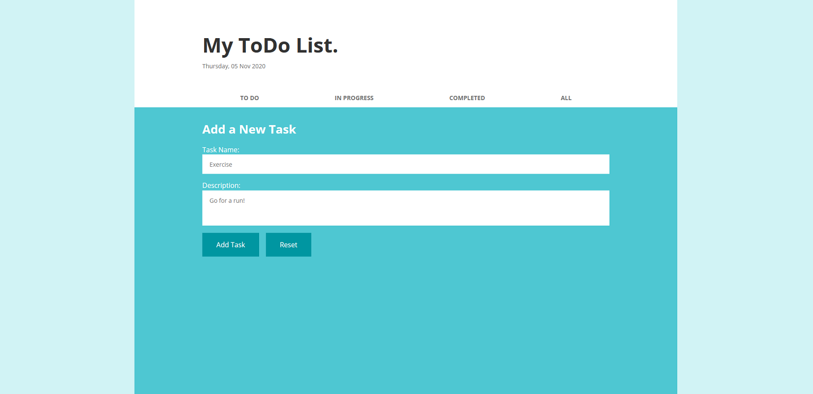

# todo-app

<b>About:</b>  
Simple ToDo app to learn Node, Express, Server-side Rendering, SASS  
Features basic CRUD operations

Design inspired by mockup found on Dribble.  
https://dribbble.com/shots/3528803-Daily-UI-042-To-Do-List 

<b>How to run:</b>  
1 - Clone repo  
2 - Run 'npm install'  
3 - Run 'npm run devstart'  
4 - Open 'http://localhost:3000/'  

<b>Home / Category Page</b>   
-Click on item to expand description  
-Click on tabs to show other categories  
-Click on 'Add Item' to create new task  

<b>All Tasks Category</b>    
-When task is highlighted, function icons appear  
-Icons include: Delete, Edit, Mark Todo, Mark In Progress, Mark Complete

<b>New Item Form</b>  
-Enter name and description to add to database  
-Similar form when editing tasks  
-Form will refuse empty inputs 

